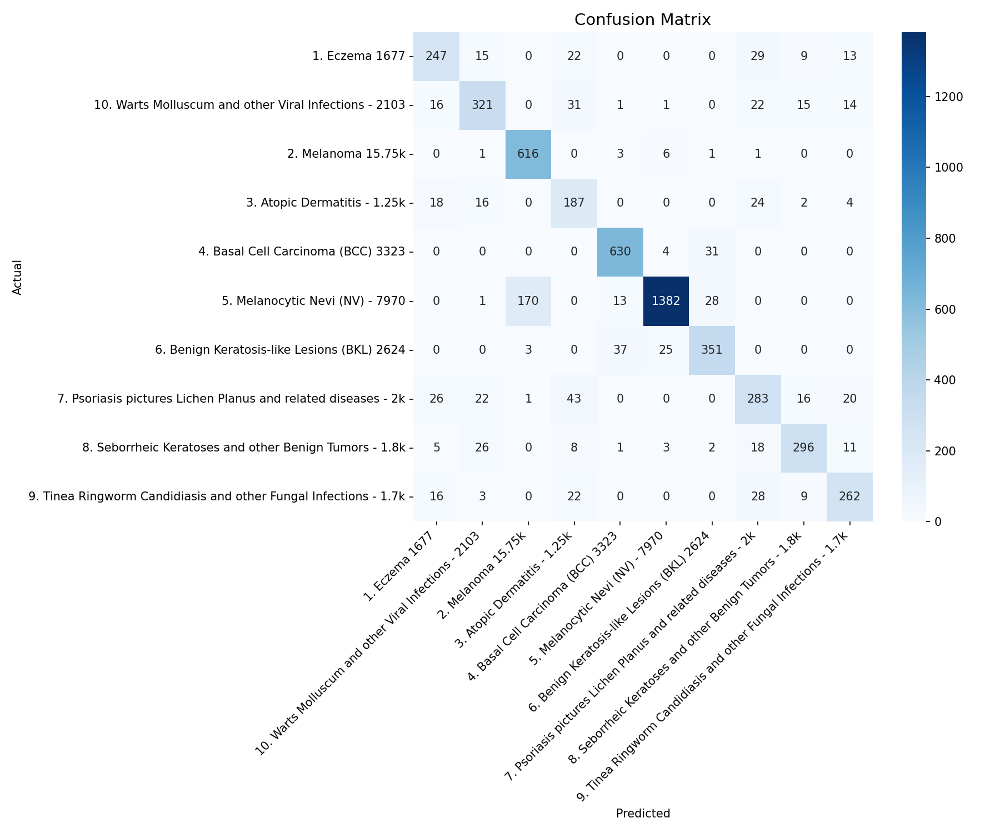
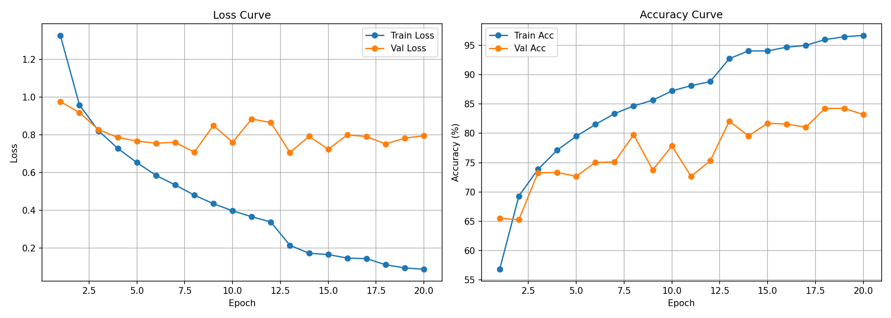
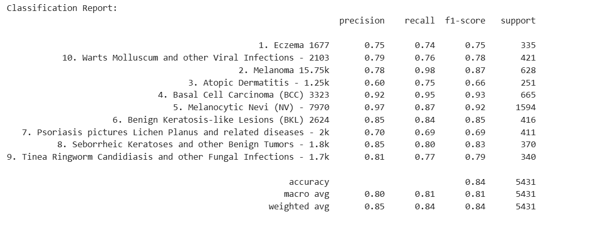
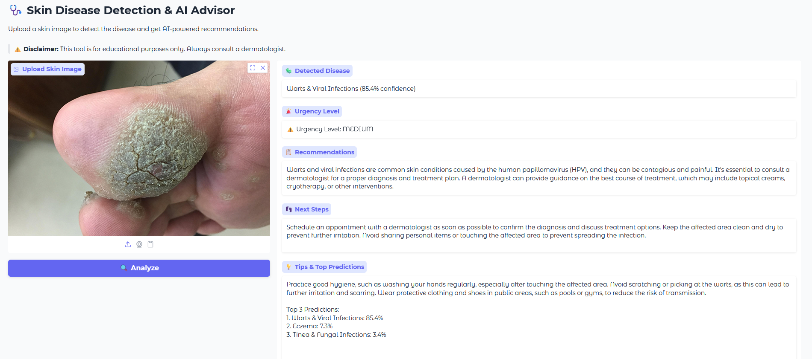

# 🩺 Skin Disease Detection & AI Advisor System

An AI-powered skin disease detection system that analyzes skin images, classifies diseases using deep learning, and provides medical recommendations using an LLM.


---

## 📋 Table of Contents
- [Overview](#overview)
- [Features](#features)
- [Detectable Diseases](#detectable-diseases)
- [Tech Stack](#tech-stack)
- [Project Structure](#project-structure)
- [Setup & Installation](#setup--installation)
- [Docker Setup](#docker-setup)
- [API Documentation](#api-documentation)
- [Model Performance](#model-performance)
- [Demo](#demo)
- [Disclaimer](#disclaimer)

---

## 🔍 Overview

This system allows users to upload skin images and receive:
- **Disease classification** using EfficientNet-B0 (Transfer Learning)
- **Confidence score** for the prediction
- **AI-powered recommendations** using Groq LLaMA3
- **Next steps** and **daily tips** for managing the condition

---

## ✨ Features

- 📸 **Image Upload API** — Upload skin images via REST API
- 🧠 **Deep Learning Classification** — EfficientNet-B0 fine-tuned on 10 skin diseases
- 💬 **LLM Recommendations** — Groq LLaMA3 generates personalized medical advice
- ⚡ **Real-time Response** — Fast inference pipeline
- 🖥️ **Demo UI** — Interactive Gradio interface
- 📊 **Top 3 Predictions** — Shows top 3 possible diseases with confidence scores
- 🐳 **Docker Support** — Containerized for easy deployment

---

## 🦠 Detectable Diseases

| #   | Disease                   |
| --- | ------------------------- |
| 1   | Eczema                    |
| 2   | Melanoma                  |
| 3   | Atopic Dermatitis         |
| 4   | Basal Cell Carcinoma      |
| 5   | Melanocytic Nevi          |
| 6   | Benign Keratosis          |
| 7   | Psoriasis & Lichen Planus |
| 8   | Seborrheic Keratoses      |
| 9   | Tinea & Fungal Infections |
| 10  | Warts & Viral Infections  |

---

## 🛠️ Tech Stack

| Component         | Technology                      |
| ----------------- | ------------------------------- |
| Backend           | Python, FastAPI                 |
| Frontend          | Gradio                          |
| Deep Learning     | PyTorch, EfficientNet-B0 (timm) |
| LLM               | Groq (LLaMA3-70b)               |
| Training Platform | Kaggle (Tesla T4 GPU)           |
| Public URL        | ngrok                           |
| Deployment        | Docker                          |

---

## 📁 Project Structure

```
skin-disease-detection/
│
├── notebooks/
│   ├── training.ipynb              # Kaggle training notebook
│   └── inference_api.ipynb         # Colab inference + API notebook
│
├── models/
│   └── class_names.json            # Class names mapping
│
├── assets/
│   ├── confusion_matrix.png        # Model evaluation
│   ├── training_curves.png         # Training history
│   └── classification_report.png  # Per-class performance
│
├── Dockerfile                      # Docker configuration
├── docker-compose.yml              # Docker Compose configuration
├── .env.example                    # Environment variables template
├── .gitignore                      # Git ignore rules
├── requirements.txt                # Python dependencies
└── README.md
```

---

## ⚙️ Setup & Installation

### 1. Clone the repository
```bash
git clone https://github.com/mahmudul-eng/skin-disease-detection.git
cd skin-disease-detection
```

### 2. Install dependencies
```bash
pip install -r requirements.txt
```

### 3. Set up API keys
Copy `.env.example` to `.env` and fill in your keys:
```bash
cp .env.example .env
```

```
GROQ_API_KEY=your_groq_api_key_here
NGROK_AUTH_TOKEN=your_ngrok_authtoken_here
```

### 4. Download model weights
- Download `best_model.pt` from [Google Drive](https://drive.google.com/drive/folders/1W920dOjGfHkkpIgnu-iBvlG45gbPMuPx?usp=sharing)
- Place it in the `models/` folder

### 5. Run on Google Colab
Open `notebooks/inference_api.ipynb` in Google Colab and run all cells.

---

## 🐳 Docker Setup

### Prerequisites
- Install [Docker](https://docs.docker.com/get-docker/)
- Install [Docker Compose](https://docs.docker.com/compose/install/)

### Steps

**1. Clone the repo:**
```bash
git clone https://github.com/mahmudul-eng/skin-disease-detection.git
cd skin-disease-detection
```

**2. Create your `.env` file:**
```bash
cp .env.example .env
# Edit .env and add your API keys
```

**3. Download model weights:**
- Download `best_model.pt` from [Google Drive](https://drive.google.com/drive/folders/1W920dOjGfHkkpIgnu-iBvlG45gbPMuPx?usp=sharing)
- Place it inside the `models/` folder

**4. Build and run with Docker Compose:**
```bash
docker-compose up --build
```

**5. Access the app:**
- Gradio UI: `http://localhost:7860`
- FastAPI docs: `http://localhost:8000/docs`

**6. Stop the container:**
```bash
docker-compose down
```

---

## 📡 API Documentation

### Base URL
```
https://your-ngrok-url.ngrok-free.app
```

### Endpoints

#### `GET /`
Health check
```json
{
  "message": "Skin Disease Detection API is running!"
}
```

#### `GET /health`
System status
```json
{
  "status": "healthy",
  "model": "EfficientNet-B0",
  "classes": 10,
  "device": "cuda"
}
```

#### `POST /analyze_skin`
Quick analysis — disease and confidence only

**Request:**
```bash
curl -X POST "https://your-url/analyze_skin" \
  -F "file=@skin_image.jpg"
```

**Response:**
```json
{
  "disease": "Eczema",
  "confidence": 0.92
}
```

#### `POST /analyze_skin_full`
Full analysis — disease + LLM recommendations

**Request:**
```bash
curl -X POST "https://your-url/analyze_skin_full" \
  -F "file=@skin_image.jpg"
```

**Response:**
```json
{
  "disease": "Eczema",
  "confidence": 0.92,
  "recommendations": "Eczema is a chronic skin condition...",
  "next_steps": "Schedule an appointment with a dermatologist...",
  "tips": "Avoid scratching the affected area...",
  "urgency": "medium",
  "top3_predictions": [
    {"disease": "Eczema", "confidence": 0.92},
    {"disease": "Atopic Dermatitis", "confidence": 0.05},
    {"disease": "Psoriasis & Lichen Planus", "confidence": 0.02}
  ]
}
```

---

## 📊 Model Performance

| Metric                | Value                                |
| --------------------- | ------------------------------------ |
| Model                 | EfficientNet-B0                      |
| Dataset               | Skin Diseases Image Dataset (Kaggle) |
| Total Classes         | 10                                   |
| Validation Accuracy   | **84.24%**                           |
| Macro Avg F1-Score    | **0.81**                             |
| Weighted Avg F1-Score | **0.84**                             |
| Training Platform     | Kaggle (T4 GPU)                      |
| Epochs                | 20                                   |

### Per-Class Performance

| Disease                   | Precision | Recall | F1-Score   |
| ------------------------- | --------- | ------ | ---------- |
| Eczema                    | 0.75      | 0.74   | 0.75       |
| Warts & Viral Infections  | 0.79      | 0.76   | 0.78       |
| Melanoma                  | 0.78      | 0.98   | **0.87**   |
| Atopic Dermatitis         | 0.60      | 0.75   | 0.66       |
| Basal Cell Carcinoma      | 0.92      | 0.95   | **0.93** 🌟 |
| Melanocytic Nevi          | 0.97      | 0.87   | **0.92** 🌟 |
| Benign Keratosis          | 0.85      | 0.84   | 0.85       |
| Psoriasis & Lichen Planus | 0.70      | 0.69   | 0.69       |
| Seborrheic Keratoses      | 0.85      | 0.80   | 0.83       |
| Tinea & Fungal Infections | 0.81      | 0.77   | 0.79       |

### Confusion Matrix


### Training Curves


### Classification Report


---

## 🎬 Demo

> Upload a skin image → Get disease prediction + AI recommendations instantly



---

## ⚠️ Disclaimer

This tool is for **educational purposes only**. It is not a substitute for professional medical advice, diagnosis, or treatment. Always consult a qualified dermatologist for proper medical evaluation.

---

## 📦 Requirements

```
fastapi
uvicorn
python-multipart
pyngrok
gradio
timm
groq
nest-asyncio
Pillow
torch
torchvision
scikit-learn
```
